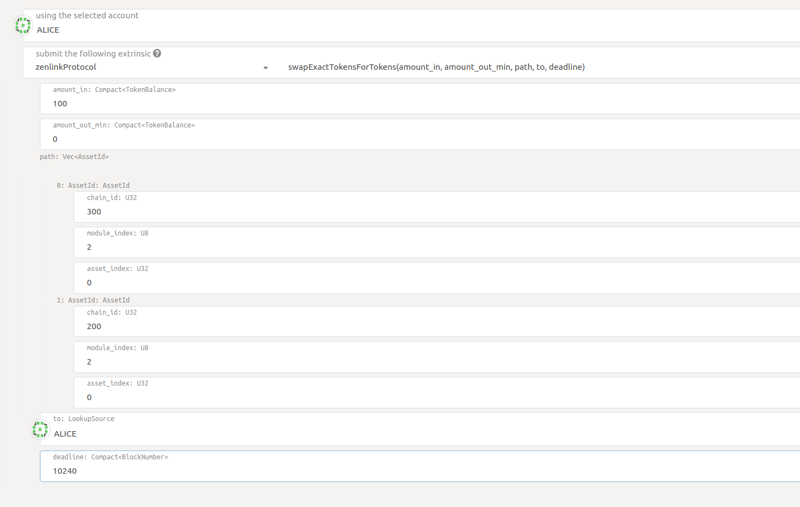

# Integration

##  Supported dependencies

It should at least work until the following commits

-   rustc 1.49.0-nightly (beb5ae474 2020-10-04)
-   polkadot.js.org (apps v0.78.2-6)
-   Polkadot rococo-v1 @ `dcebc8177412a3ac7891283d1441f1a346e9982c`
-   Cumulus rococo-v1 @ `4b69b8d4bfa113fb3af2da34d1b71313bc43fb0c`
-   Substrate rococo-v1 (newer than 2.0.0) @ `0b0d124d5f9be89f614f2be8e9da038fcb9f540e`


## Precondition
* Open Native Currency asset control to Zenlink Dex Module. BThe ZenLink DEX Module can call both the Withdraw and Deposit methods.
* Parachain’s MessageBroker routes XCM messages to the Zenlink Dex Module.
* Establish HRMP channels between parachains.

## Example
The following shows how to deploy the ZenLink Dex Module using Rococo as an example.
The current stable version of ZenLink Dex Module is based on Cumulus rococo-v1@48558 a2bf666eba6be5b3a3b0d9ce9459bc4a714.

### Clone cumulus code

```
git clone https://github.com/paritytech/cumulus.git
cd cumulus
git checkout rococo-v1
git checkout 48558a2bf666eba6be5b3a3b0d9ce9459bc4a714
```

### Clone Zenlink DEX Module code
```
git clone git@github.com:zenlinkpro/Zenlink-DEX-Module.git
```

### Add Zenlink DEX Module in runtime
1. Copy the Zenlink Dex Module into the Cumulus code folder
2. Modify the project file
```
// runtime/Cargo.toml
[package]
…

[dependencies]
…
zenlink-protocol = { path = ‘../zenlink-protocol’, default-features = false }
zenlink-protocol-runtime-api = { path = “../zenlink-protocol/rpc/runtime-api”, default-features = false }
…
[features]
default = [‘std’]
std = [
…
	'zenlink-protocol/std',
	'zenlink-protocol-runtime-api/std',
...
]


// node/Cargo.toml

[[bin]]
...
[dependencies]
...
zenlink-protocol-runtime-api = { path = "../zenlink-protocol/rpc/runtime-api" }
zenlink-protocol-rpc = { path = "../zenlink-protocol/rpc" }
...

/// Add RPC API to node
# node/src/service.rs

...
pub async fn start_node(
	parachain_config: Configuration,
	collator_key: CollatorPair,
	polkadot_config: Configuration,
	id: polkadot_primitives::v0::Id,
	validator: bool,
) -> sc_service::error::Result<(TaskManager, Arc<TFullClient<Block, RuntimeApi, Executor>>)> {
	start_node_impl(
		parachain_config,
		collator_key,
		polkadot_config,
		id,
		validator,
		|client| {
			let mut io = jsonrpc_core::IoHandler::default();

			use zenlink_protocol_rpc::{ZenlinkProtocol, ZenlinkProtocolApi};
			io.extend_with(ZenlinkProtocolApi::to_delegate(ZenlinkProtocol::new(
				client,
			)));
			io
		},
	)
	.await
}
...

// Add Zenlink DEX Module to runtime
// runtime/src/lib.rs

...
// use Zenlink DEX Module
use zenlink_protocol::{
	AccountId32Aliases, AssetId, FilterAssetLocation, Junction, LocationInverter, MultiAsset,
	MultiLocation, NetworkId, Origin as ZenlinkOrigin, PairInfo, ParentIsDefault,
	RelayChainAsNative, SiblingParachainAsNative, SiblingParachainConvertsVia,
	SignedAccountId32AsNative, SovereignSignedViaLocation, TokenBalance, Transactor, XcmCfg,
	XcmExecutor,
};
...

// Zenlink DEX Module instantiation
impl zenlink_protocol::Config for Runtime {
	type Event = Event;
	type TokenBalance = TokenBalance;
	type XcmExecutor = XcmExecutor<XcmConfig>;
	type UpwardMessageSender = MessageBroker;
	type HrmpMessageSender = MessageBroker;

	type NativeCurrency = Balances;
	type AccountIdConverter = LocationConverter;
	type AccountId32Converter = AccountId32Converter;
	type ParaId = ParachainInfo;
	type ModuleId = DEXModuleId;
}
...

// Set XCM message processor as Zenlink DEX Module
impl cumulus_message_broker::Config for Runtime {
	type DownwardMessageHandlers = ZenlinkProtocol;
	type HrmpMessageHandlers = ZenlinkProtocol;
}

...

// Add Zenlink DEX Module to runtime
construct_runtime! {
	pub enum Runtime where
		Block = Block,
		NodeBlock = dev_parachain_primitives::Block,
		UncheckedExtrinsic = UncheckedExtrinsic,
	{
		...
		// ASSETS_PALLET_INDEX
		ZenlinkProtocol: zenlink_protocol::{Module, Origin, Call, Storage, Event<T>} = 10,
    ...
	}
}
...

impl_runtime_apis! {
...
	// RPC implementation
	impl zenlink_protocol_runtime_api::ZenlinkProtocolApi<Block, AccountId, TokenBalance> for Runtime {
		fn get_assets() -> Vec<AssetId> {
			ZenlinkProtocol::assets_list()
		}

		fn get_balance(
			asset_id: AssetId,
			owner: AccountId
		) -> TokenBalance {
			ZenlinkProtocol::asset_balance_of(&asset_id, &owner)
		}

		fn get_all_pairs() -> Vec<PairInfo<AccountId, TokenBalance>> {
			ZenlinkProtocol::get_all_pairs()
		}

		fn get_owner_pairs(
			owner: AccountId
		) -> Vec<PairInfo<AccountId, TokenBalance>> {
			ZenlinkProtocol::get_owner_pairs(&owner)
		}

		//buy amount token price
		fn get_amount_in_price(
			path: Vec<AssetId>
		) -> TokenBalance {
			ZenlinkProtocol::get_in_price(path)
		}

		//sell amount token price
		fn get_amount_out_price(
			path: Vec<AssetId>
		) -> TokenBalance {
			ZenlinkProtocol::get_out_price(path)
		}
	}
}
...
```

### Compile Relaychain
```
git clone https://github.com/paritytech/polkadot.git
git checkout rococo-v1
git checkout 0022f1f7bfd0799c8a45a8a3749ce4e8fc556bed
cd polkadot & cargo build --release --features=real-overseer
```
### Run testnet
In this case, the test network consists of 5 Relaychain nodes and 2 Parachain Collectors. The Parachain IDs are 200 and 300, respectively.
Execute the following shell script to generate the required files, including the Relaychain configuration file, the Parachain Genesis file, and the WASM file.

```
#!/bin/bash

# polkadot
cp ../polkadot/target/release/polkadot .
mkdir config

./polkadot build-spec --chain rococo-local --disable-default-bootnode > ./config/rococo-custom-local.json
sed -i 's/"validation_upgrade_frequency": 600/"validation_upgrade_frequency": 10/g' ./config/rococo-custom-local.json
sed -I ’s/“validation_upgrade_delay”: 300/“validation_upgrade_delay”: 5/g’ ./config/rococo-custom-local.json
./polkadot build-spec —chain ./config/rococo-custom-local.json —disable-default-bootnode —raw > ./config/rococo-local.json


# dev-parachain
cp ../dev-parachain/target/release/dev-parachain .

./dev-parachain build-spec —disable-default-bootnode > ./config/200para.json
sed -I ’s/“para_id”: 500,/“para_id”: 200,/g’ ./config/200para.json
sed -I ’s/“parachainId”: 500/“parachainId”: 200/g’ ./config/200para.json
./dev-parachain export-genesis-state —parachain-id 200 > ./config/200.genesis

./dev-parachain build-spec —disable-default-bootnode > ./config/300para.json
sed -I ’s/“para_id”: 500,/“para_id”: 300,/g’ ./config/300para.json
sed -I ’s/“parachainId”: 500/“parachainId”: 300/g’ ./config/300para.json
./dev-parachain export-genesis-state —parachain-id 300 > ./config/300.genesis

./dev-parachain export-genesis-wasm > ./config/200-300.wasm
```

Execute the following shell script to start the testnet.

```
#!/bin/bash

cp config/rococo-custom-local.json config/rococo-custom-local-5.json
sed ‘/palletSession/,/palletGrandpa/{/palletSession/!{/palletGrandpa/!d}}’ -I config/rococo-custom-local-5.json
sed ‘/palletSession/ r palletSession.txt’ -I config/rococo-custom-local-5.json

./polkadot build-spec —chain config/rococo-custom-local-5.json —disable-default-bootnode —raw > config/rococo-local-5.json

mkdir data

./polkadot  —ws-port 9944 —rpc-port 10025 —port 30033  -d ./data/data-a —validator —chain config/rococo-local-5.json —Alice   > ./data/log.a 2>&1 &
./polkadot  —ws-port 9946 —rpc-port 10026 —port 30034  -d ./data/data-b —validator —chain config/rococo-local-5.json —bob     > ./data/log.b 2>&1 &
./polkadot  —ws-port 9947 —rpc-port 10027 —port 30035  -d ./data/data-c —validator —chain config/rococo-local-5.json —Charlie > ./data/log.c 2>&1 &
./polkadot  —ws-port 9948 —rpc-port 10028 —port 30036  -d ./data/data-d —validator —chain config/rococo-local-5.json —Dave    > ./data/log.d 2>&1 &
./polkadot  —ws-port 9949 —rpc-port 10029 —port 30037  -d ./data/data-e —validator —chain config/rococo-local-5.json —eve     > ./data/log.e 2>&1 &


./dev-parachain -d ./data/data-200  —ws-port 9977 —port 30336 —rpc-port 10002 —rpc-cors all —unsafe-ws-external  —unsafe-rpc-external  —parachain-id 200  —validator —execution=native -lruntime=debug,cumulus-collator=trace,cumulus-network=trace,cumulus-consensus=trace —chain ./config/200para.json  —   —chain ./config/rococo-local-5.json  —discover-local —execution=wasm > ./data/log.200 2>&1 &

./dev-parachain -d ./data/data-300  —ws-port 9988 —port 30337 —rpc-port 10003 —rpc-cors all —unsafe-ws-external  —unsafe-rpc-external  —parachain-id 300  —validator —execution=native -lruntime=debug,cumulus-collator=trace,cumulus-network=trace,cumulus-consensus=trace —chain ./config/300para.json  —   —chain ./config/rococo-local-5.json  —discover-local —execution=wasm > ./data/log.300 2>&1 &
```

### Register Parachain & Establish HRMP channel
Connect Relaychain with endpoint 'ws://127.0.0.1:9944' on https://polkadot.js.org/apps
- Register Parachain200


- Register Parachain300


- Establish HRMP channel, Parachain200 -> Parachain300


- Establish HRMP channel, Parachain300 -> Parachain200


Transaction type

```
{
    "PairId": "u32",
    "Pair": {
      "token_0": "AssetId",
      "token_1": "AssetId",
      "account": "AccountId",
      "total_liquidity": "TokenBalance"
    },
    "PairInfo": {
      "token_0": "AssetId",
      "token_1": "AssetId",
      "account": "AccountId",
      "total_liquidity": "TokenBalance",
      "holding_liquidity": "TokenBalance",
      "reserve_0": "TokenBalance",
      "reserve_1": "TokenBalance"
    },
    "AssetId": {
      "_enum": {
        "NativeCurrency": null,
        "ParaCurrency": "u32"
      }
    },
    "TokenBalance": "u128"
}
```

Switch to 'Settings' -> 'Developer', input the above json, then save.


### Add liquidity
There is a trading pair on Parachain300. Call the following method.


### Swap

