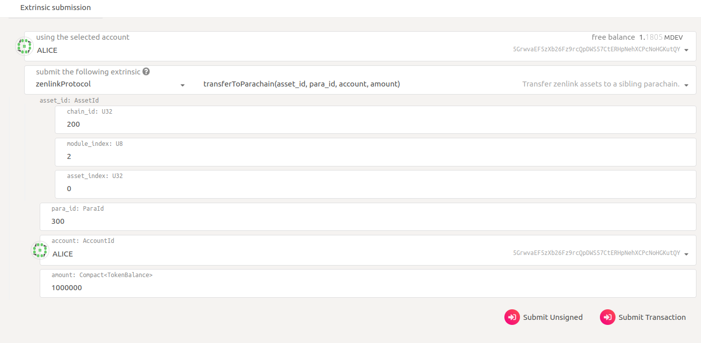
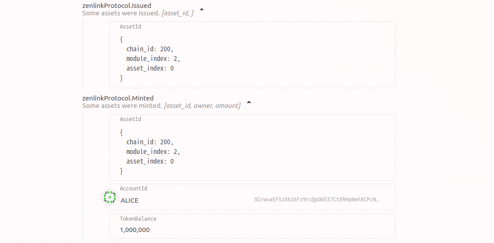
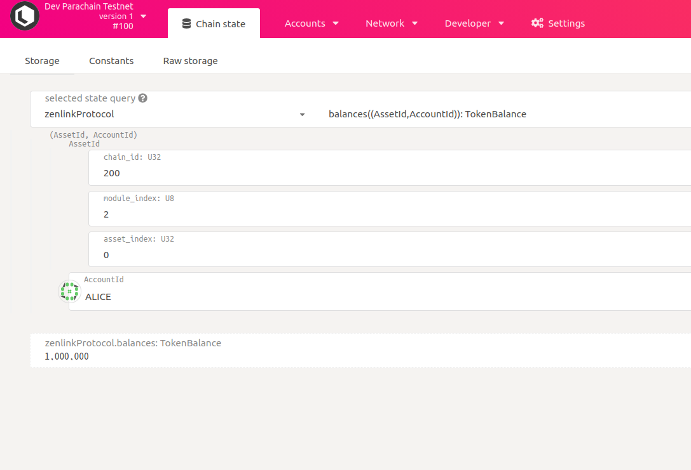
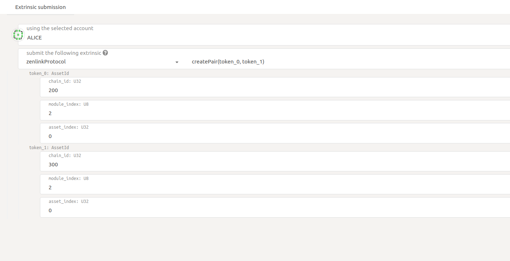
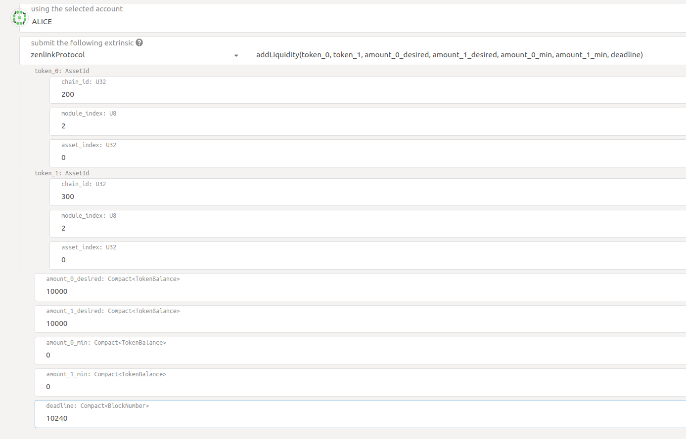

# Integration

##  Supported dependencies

It should at least work until the following commits

-   rustc 1.52.0-nightly (d1206f950 2021-02-15)
-   polkadot.js.org (apps v0.85.2-7)
-   Polkadot rococo-v1 @ `34e8d5061434c039f0e13c8319dedf54dbb4bc81`
-   Cumulus rococo-v1 @ `90b1e1804897193b3911f49b45de51532e305733`
-   Substrate rococo-v1  @ `1404f2af4cbe90d35b4c8a1405a9452feb789adc`


## Precondition
* Open Native Currency asset control to Zenlink Dex Module. BThe ZenLink DEX Module can call both the Withdraw and Deposit methods.
* Parachain’s MessageBroker routes XCM messages to the Zenlink Dex Module.
* Establish HRMP channels between parachains.

## Example
The following shows how to deploy the ZenLink Dex Module using Rococo as an example.

### Clone cumulus code

```
git clone https://github.com/paritytech/cumulus.git
cd cumulus
git checkout rococo-v1
git checkout 24b1ee6bd1d96f255889f167e59ef9c9399a6305
```

### Clone Zenlink DEX Module code
```
git clone git@github.com:zenlinkpro/Zenlink-DEX-Module.git
```

### Add Zenlink DEX Module in runtime
1. Copy the Zenlink Dex Module into the Cumulus code folder
2. Config runtime
```
**1. Modify the project file**
// runtime/Cargo.toml
[package]
…

[dependencies]
…
zenlink-protocol = { path = ‘../zenlink-protocol’, default-features = false }
zenlink-protocol-runtime-api = { path = “../zenlink-protocol/rpc/runtime-api”, default-features = false }
…
[features]
default = [‘std’]
std = [
…
	'zenlink-protocol/std',
	'zenlink-protocol-runtime-api/std',
...
]


// node/Cargo.toml

[[bin]]
...
[dependencies]
...
zenlink-protocol-runtime-api = { path = "../zenlink-protocol/rpc/runtime-api" }
zenlink-protocol-rpc = { path = "../zenlink-protocol/rpc" }

**2.Add RPC API to node** 
//node/src/service.rs
...
pub async fn start_node(
	parachain_config: Configuration,
	collator_key: CollatorPair,
	polkadot_config: Configuration,
	id: polkadot_primitives::v0::Id,
	validator: bool,
) -> sc_service::error::Result<(TaskManager, Arc<TFullClient<Block, RuntimeApi, Executor>>)> {
	start_node_impl(
		parachain_config,
		collator_key,
		polkadot_config,
		id,
		validator,
		|client| {
			let mut io = jsonrpc_core::IoHandler::default();

			use zenlink_protocol_rpc::{ZenlinkProtocol, ZenlinkProtocolApi};
			io.extend_with(ZenlinkProtocolApi::to_delegate(ZenlinkProtocol::new(
				client,
			)));
			io
		},
	)
	.await
}
...

**3 Add Zenlink DEX Module to runtime.** 
// We can refer to the `example` folder
// runtime/src/zenlink.rs

...
// use Zenlink DEX Module
use zenlink_protocol::{
    AccountId32Aliases, Junction, LocationInverter, MultiLocation, NetworkId, OperationalAsset,
    Origin as ZenlinkOrigin, ParaChainWhiteList, ParentIsDefault, RelayChainAsNative, Sibling,
    SiblingParachainAsNative, SiblingParachainConvertsVia, SignedAccountId32AsNative,
    SovereignSignedViaLocation, TokenBalance, Transactor, XcmCfg, XcmExecutor,
};
...

// Zenlink DEX Module instantiation
impl zenlink_protocol::Config for Runtime {
    type Event = Event;
    type XcmExecutor = XcmExecutor<XcmConfig>;
    type UpwardMessageSender = ParachainSystem;
    type HrmpMessageSender = ParachainSystem;
    type NativeCurrency = Balances;
    type AccountIdConverter = LocationConverter;
    type AccountId32Converter = AccountId32Converter;
    type ParaId = ParachainInfo;
    type ModuleId = DEXModuleId;
    type TargetChains = SiblingParachains;
    // If you want the assets generated by a module to realize cross-chain circulation in the zenlink protocol. 
    // Then this module must implement the OperationalAsset trait.
    type OperationalAsset = OtherAssets;
}
...

**4. Set Balance module index.**
// Change the `NATIVE_CURRENCY_MODULE_INDEX` value in  zenlink-protocol/primitives.rs
// `Make NATIVE_CURRENCY_MODULE_INDEX` equal to the index of the balances module
// In this example NATIVE_CURRENCY_MODULE_INDEX == 2

**5.Set XCM message processor as Zenlink DEX Module**
impl cumulus_pallet_parachain_system::Config for Runtime {
    type Event = Event;
    type OnValidationData = ();
    type SelfParaId = ParachainInfo;
    type DownwardMessageHandlers = ZenlinkProtocol;
    type HrmpMessageHandlers = ZenlinkProtocol;
}

...

**5.Add Zenlink DEX Module to runtime**
// runtime/src/zenlink.rs
construct_runtime! {
	pub enum Runtime where
		Block = Block,
		NodeBlock = dev_parachain_primitives::Block,
		UncheckedExtrinsic = UncheckedExtrinsic,
	{
		...
		// ASSETS_PALLET_INDEX
		ZenlinkProtocol: zenlink_protocol::{Module, Origin, Call, Storage, Event<T>},
    ...
	}
}
...

**6.Add Zenlink rpc**
impl_runtime_apis! {
...
	// RPC implementation
	    impl zenlink_protocol_runtime_api::ZenlinkProtocolApi<Block, AccountId> for Runtime {
        fn get_assets() -> Vec<AssetId> {
            ZenlinkProtocol::assets_list()
        }

        fn get_balance(
            asset_id: AssetId,
            owner: AccountId
        ) -> TokenBalance {
            ZenlinkProtocol::multi_asset_balance_of(&asset_id, &owner)
        }

        fn get_sovereigns_info(
            asset_id: AssetId
        ) -> Vec<(u32, AccountId, TokenBalance)> {
            ZenlinkProtocol::get_sovereigns_info(&asset_id)
        }

        fn get_all_pairs() -> Vec<PairInfo<AccountId, TokenBalance>> {
            ZenlinkProtocol::get_all_pairs()
        }

        fn get_owner_pairs(
            owner: AccountId
        ) -> Vec<PairInfo<AccountId, TokenBalance>> {
            ZenlinkProtocol::get_owner_pairs(&owner)
        }

        //buy amount token price
        fn get_amount_in_price(
            supply: TokenBalance,
            path: Vec<AssetId>
        ) -> TokenBalance {
            ZenlinkProtocol::desired_in_amount(supply, path)
        }

        //sell amount token price
        fn get_amount_out_price(
            supply: TokenBalance,
            path: Vec<AssetId>
        ) -> TokenBalance {
            ZenlinkProtocol::supply_out_amount(supply, path)
        }

        fn get_estimate_lptoken(
            token_0: AssetId,
            token_1: AssetId,
            amount_0_desired: TokenBalance,
            amount_1_desired: TokenBalance,
            amount_0_min: TokenBalance,
            amount_1_min: TokenBalance,
        ) -> TokenBalance{
            ZenlinkProtocol::get_estimate_lptoken(
                token_0,
                token_1,
                amount_0_desired,
                amount_1_desired,
                amount_0_min,
                amount_1_min)
        }
    }
}
...
```

### Compile Relaychain
```
git clone https://github.com/paritytech/polkadot.git
git checkout rococo-v1
git checkout 0022f1f7bfd0799c8a45a8a3749ce4e8fc556bed
cd polkadot & cargo build --release --features=real-overseer
```
### Run testnet
In this case, the test network consists of 5 Relaychain nodes and 2 Parachain Collectors. The Parachain IDs are 200 and 300, respectively.
Execute the following shell script to generate the required files, including the Relaychain configuration file, the Parachain Genesis file, and the WASM file.

```
#!/bin/bash

# polkadot
cp ../polkadot/target/release/polkadot .
mkdir config

./polkadot build-spec --chain rococo-local --disable-default-bootnode > ./config/rococo-custom-local.json
sed -i 's/"validation_upgrade_frequency": 600/"validation_upgrade_frequency": 10/g' ./config/rococo-custom-local.json
sed -I ’s/“validation_upgrade_delay”: 300/“validation_upgrade_delay”: 5/g’ ./config/rococo-custom-local.json
./polkadot build-spec —chain ./config/rococo-custom-local.json —disable-default-bootnode —raw > ./config/rococo-local.json


# dev-parachain
cp ../dev-parachain/target/release/dev-parachain .

./dev-parachain build-spec —disable-default-bootnode > ./config/200para.json
sed -I ’s/“para_id”: 500,/“para_id”: 200,/g’ ./config/200para.json
sed -I ’s/“parachainId”: 500/“parachainId”: 200/g’ ./config/200para.json
./dev-parachain export-genesis-state —parachain-id 200 > ./config/200.genesis

./dev-parachain build-spec —disable-default-bootnode > ./config/300para.json
sed -I ’s/“para_id”: 500,/“para_id”: 300,/g’ ./config/300para.json
sed -I ’s/“parachainId”: 500/“parachainId”: 300/g’ ./config/300para.json
./dev-parachain export-genesis-state —parachain-id 300 > ./config/300.genesis

./dev-parachain export-genesis-wasm > ./config/200-300.wasm
```

Execute the following shell script to start the testnet.

```
#!/bin/bash

cp config/rococo-custom-local.json config/rococo-custom-local-5.json
sed ‘/palletSession/,/palletGrandpa/{/palletSession/!{/palletGrandpa/!d}}’ -I config/rococo-custom-local-5.json
sed ‘/palletSession/ r palletSession.txt’ -I config/rococo-custom-local-5.json

./polkadot build-spec —chain config/rococo-custom-local-5.json —disable-default-bootnode —raw > config/rococo-local-5.json

mkdir data

./polkadot  —ws-port 9944 —rpc-port 10025 —port 30033  -d ./data/data-a —validator —chain config/rococo-local-5.json —Alice   > ./data/log.a 2>&1 &
./polkadot  —ws-port 9946 —rpc-port 10026 —port 30034  -d ./data/data-b —validator —chain config/rococo-local-5.json —bob     > ./data/log.b 2>&1 &
./polkadot  —ws-port 9947 —rpc-port 10027 —port 30035  -d ./data/data-c —validator —chain config/rococo-local-5.json —Charlie > ./data/log.c 2>&1 &
./polkadot  —ws-port 9948 —rpc-port 10028 —port 30036  -d ./data/data-d —validator —chain config/rococo-local-5.json —Dave    > ./data/log.d 2>&1 &
./polkadot  —ws-port 9949 —rpc-port 10029 —port 30037  -d ./data/data-e —validator —chain config/rococo-local-5.json —eve     > ./data/log.e 2>&1 &


./dev-parachain -d ./data/data-200  —ws-port 9977 —port 30336 —rpc-port 10002 —rpc-cors all —unsafe-ws-external  —unsafe-rpc-external  —parachain-id 200  —validator —execution=native -lruntime=debug,cumulus-collator=trace,cumulus-network=trace,cumulus-consensus=trace —chain ./config/200para.json  —   —chain ./config/rococo-local-5.json  —discover-local —execution=wasm > ./data/log.200 2>&1 &

./dev-parachain -d ./data/data-300  —ws-port 9988 —port 30337 —rpc-port 10003 —rpc-cors all —unsafe-ws-external  —unsafe-rpc-external  —parachain-id 300  —validator —execution=native -lruntime=debug,cumulus-collator=trace,cumulus-network=trace,cumulus-consensus=trace —chain ./config/300para.json  —   —chain ./config/rococo-local-5.json  —discover-local —execution=wasm > ./data/log.300 2>&1 &
```

### Register Parachain & Establish HRMP channel
Connect Relaychain with endpoint 'ws://127.0.0.1:9944' on https://polkadot.js.org/apps
- Register Parachain200


- Register Parachain300


- Establish HRMP channel, Parachain200 -> Parachain300


- Establish HRMP channel, Parachain300 -> Parachain200


Transaction type

```
{
  "PairId": "u32",
  "Pair": {
    "token_0": "AssetId",
    "token_1": "AssetId",
    "account": "AccountId",
    "total_liquidity": "TokenBalance",
    "lp_asset_id": "AssetId"
  },
  "PairInfo": {
    "token_0": "AssetId",
    "token_1": "AssetId",
    "account": "AccountId",
    "total_liquidity": "TokenBalance",
    "holding_liquidity": "TokenBalance",
    "reserve_0": "TokenBalance",
    "reserve_1": "TokenBalance",
    "lp_asset_id": "AssetId"
  },
  "AssetId": {
    "chain_id": "u32",
    "module_index": "u8",
    "asset_index": "u32"
  },
  "TokenId": "u32",
  "AssetProperty":{
    "_enum": {
        "FOREIGN": null,
        "LP": "LpProperty"
      }
  },
  "LpProperty": {
    "token_0": "AssetId",
    "token_1": "AssetId"
  },
  "TokenBalance": "u128"
}
```

Switch to 'Settings' -> 'Developer', input the above json, then save.


### Cross chain transfer
   In this example, the Balances module index equal 2 and it just has one asset.
   So the AssetId of native currency is (200,2,0). 
   It means the first asset of the second module on parachain 200.
   Now we transfer it to parachain 300.

   
   We can see the event in parachain 300.
   It means that the zenlink protocol first issued an asset, and then minted 1,000,000.

   

   We can see the result in zenlink protocol storage.

   

### Create Pair
   Now we have two assets in parachain 300. 
   So we can create a pair.
   

### Add liquidity
   

### Swap
   
